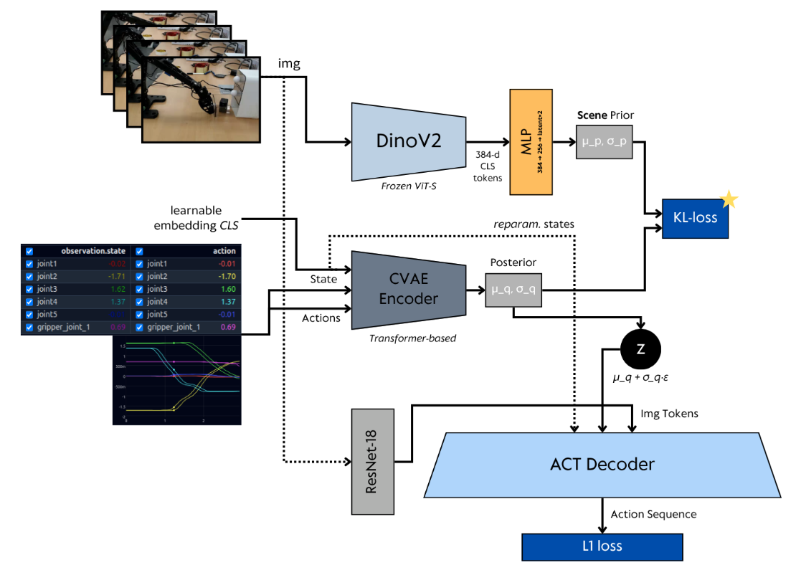
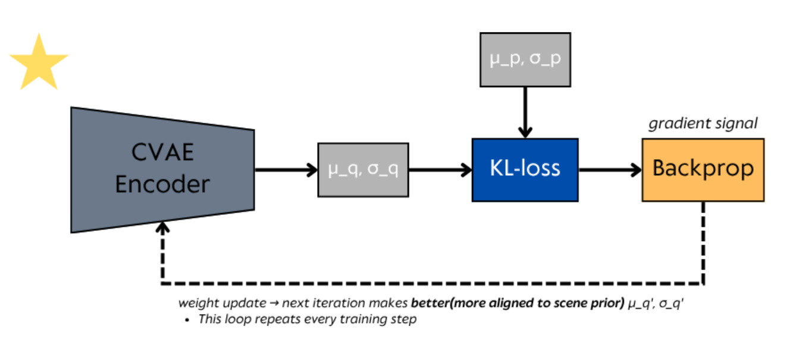
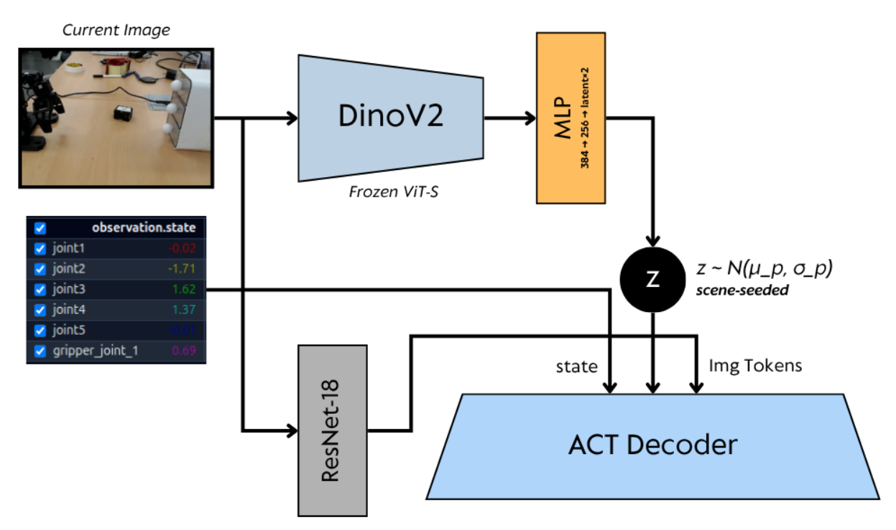

# Prior-ACT

Author: Dawit Chun

ACT with a frozen DINOv3 scene prior, for the ROBOTIS AI Worker (FFW_SG2) bimanual pick-and-place.

The prior gives the policy a latent conditioned on the camera image, available at inference. On this
dataset it reaches 13–16% lower held-out action error than vanilla ACT at matched training steps, and
reaches ACT's best value in 2.7× fewer steps.

| | best held-out L1 | at step | vs ACT |
|---|---|---|---|
| Prior-ACT | 0.1872 rad | 8000 | −16.4% |
| vanilla ACT, same data and settings | 0.2238 rad | 5500 | — |
| both at step 7000 | 0.1961 / 0.2333 | 7000 | −15.9% |

Full curve, latent diagnostics and caveats: [docs/RESULTS.md](docs/RESULTS.md).

## Contents

| | |
|---|---|
| [docs/INSTALL.md](docs/INSTALL.md) | dependencies, DINOv3 weights, installing the policy |
| [docs/ARCHITECTURE.md](docs/ARCHITECTURE.md) | the model and the three defects that had to be fixed |
| [docs/TRAINING.md](docs/TRAINING.md) | training command, every argument, multi-GPU |
| [docs/TUNING.md](docs/TUNING.md) | **how to make the prior influence the policy more or less** |
| [docs/INFERENCE.md](docs/INFERENCE.md) | deployment CLI, every knob with its measured effect |
| [docs/DIAGNOSTICS.md](docs/DIAGNOSTICS.md) | telling a working latent from a decorative one |
| [docs/RESULTS.md](docs/RESULTS.md) | measurements and caveats |

## Quick start

```bash
# install the policy into an existing lerobot tree
cp lerobot_policy/*.py <lerobot>/src/lerobot/policies/act_prior/

# train
bash scripts/train_prior.sh

# verify the latent is alive before trusting a checkpoint
python3 scripts/diagnostics/latent_health.py out/prior_fit_grid/checkpoints/008000/pretrained_model

# run on the robot
bash scripts/infer.sh out/prior_fit_grid/checkpoints/008000/pretrained_model
```


## Architecture

### Training



Two encoders produce a latent distribution. The **posterior** `q(z | actions, state)` is a
transformer CVAE encoder that sees the future action chunk; the **prior** `p(z | image)` is a frozen
DINO backbone plus an MLP head. `z` is drawn from the posterior during training and passed to the
ACT decoder alongside the ResNet-18 image tokens and the state. Two losses: L1 on the predicted
action sequence, and the KL terms that tie the two distributions together.

### The KL loop



The KL term is what couples the posterior to the scene prior. Each step it pushes `μ_q, σ_q` toward
a distribution the image alone can predict, so the latent comes to carry information the prior can
reproduce at inference.

This repository adds a **second** KL term, `KL(sg(q) ‖ p)`, which trains the prior in the opposite
direction and carries no free-bits floor. Without it the prior receives no gradient whenever every
latent dimension sits below the floor. See [docs/ARCHITECTURE.md](docs/ARCHITECTURE.md).

### Inference



The CVAE encoder is gone at inference, so vanilla ACT sets `z = 0`. Prior-ACT draws `z` from the
image-conditioned prior instead, which is the whole point: the policy conditions on the scene before
committing to a trajectory.

> The figures show the design with a **DINOv2 ViT-S** backbone and a 384-d CLS token. The
> configuration reported below uses **DINOv3 ViT-L/16** with `scene_prior_features=cls_grid`, which
> feeds the MLP the CLS token *plus* the patch grid pooled to 2×3 cells rather than CLS alone. The
> structure is otherwise as drawn.

## Model

355M parameters total, 53.5M trainable. DINOv3 ViT-L/16 is frozen.

```
q(z | actions, state)    posterior, training only
p(z | image)             prior, frozen DINOv3 + MLP, available at inference
```

Vanilla ACT sets `z = 0` at inference because its posterior encoder is unavailable. Prior-ACT draws
`z` from the image-conditioned prior instead, so the policy conditions on the scene before committing
to a trajectory.

Three properties must hold for this to be worth its parameters:

| diagnostic | meaning | measured |
|---|---|---|
| `latent_authority` | the decoder uses `z` | 0.1489 |
| `prior_post_gap` | the prior predicts the posterior | 0.0032 (2% of authority) |
| `mu_prior_std` | the prior varies with the scene | 0.0961 |

Two earlier configurations failed one of these while the loss curve looked healthy. See
[docs/ARCHITECTURE.md](docs/ARCHITECTURE.md).

## Scope

Quantitative results are held-out action L1 on 10 unseen episodes. Task success rate was not measured
under controlled conditions. Real-robot behaviour is reported qualitatively in
[docs/RESULTS.md](docs/RESULTS.md).

Prior-ACT does not address generalisation to object positions outside the demonstration
distribution; held-out error is 3.9× training-episode error and that gap is data coverage.

Results are from a single seed per arm and the component ablation has not been run.

## License

Follows the license of the LeRobot tree it is installed into. DINOv3 weights are subject to Meta's
license terms.
